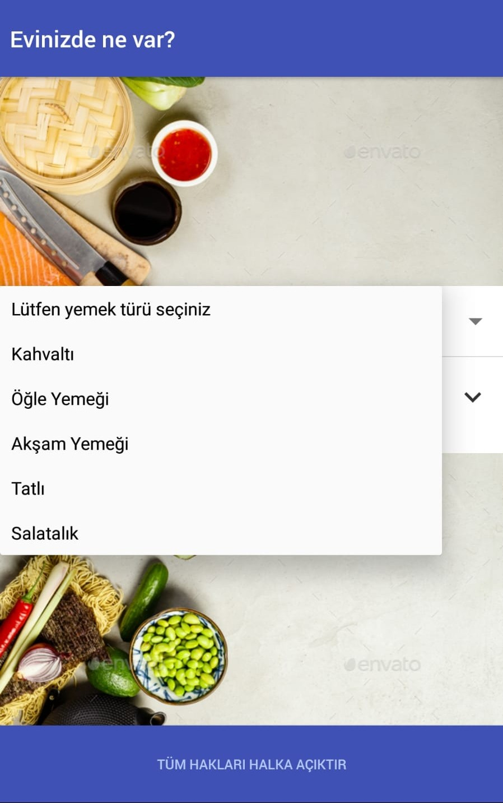
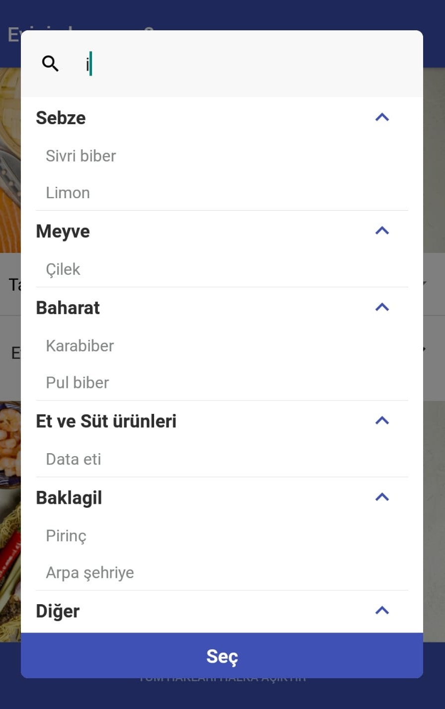
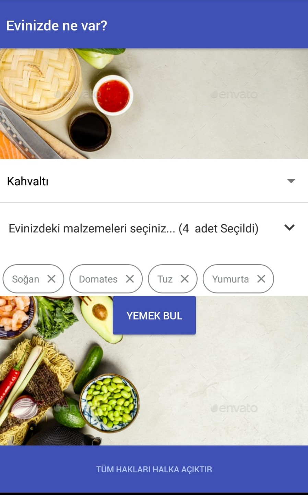
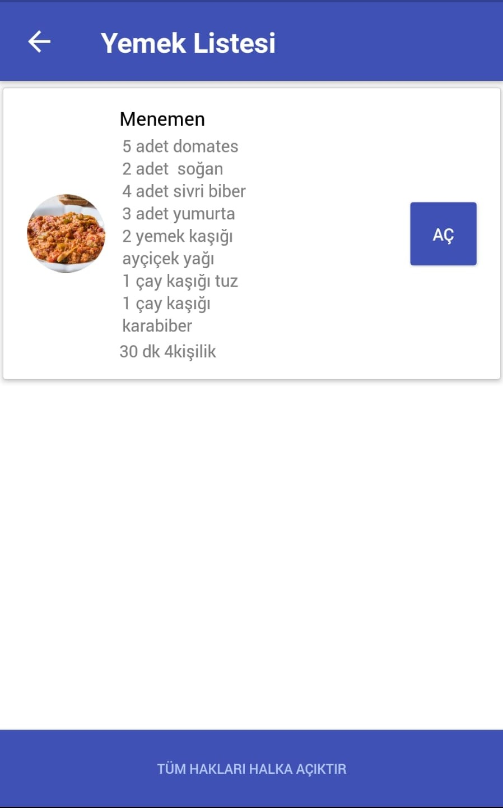
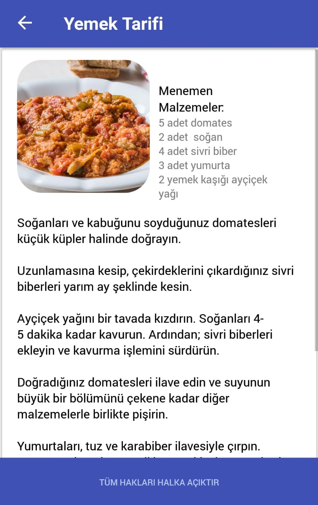

## Recipe app :fork_and_knife: :cocktail: :pizza: :cookie:

_Made with NativeBase & ReactNavigation_

## Screenshots

<div align="left" style="margin-bottom:1em">
    
    
    
    
    
</div>

## Installation :arrow_down:

- git clone
- npm start

### Clone

- Clone this repo to your local machine using `https://github.com/metinozkan/foodRecipeApp.git`

```shell
$ git clone https://github.com/metinozkan/foodRecipeApp.git
```

### Setup

```shell
$ npm install
```

### Start

-Run Android device

```shell
$ react-native run-android
$ npm start
```

---
